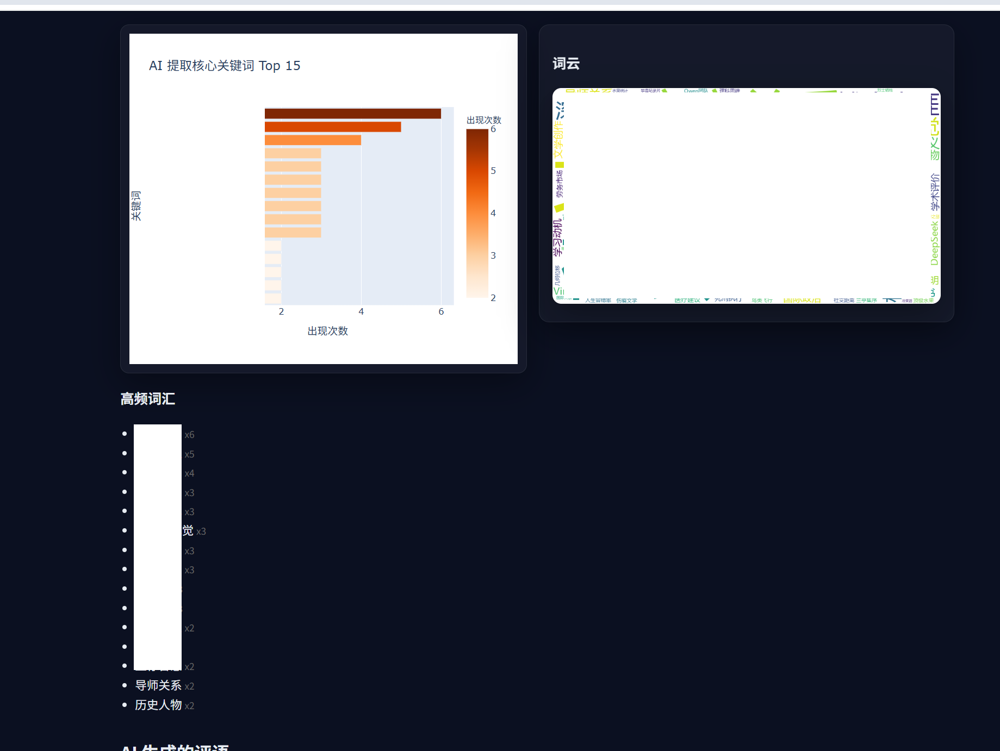
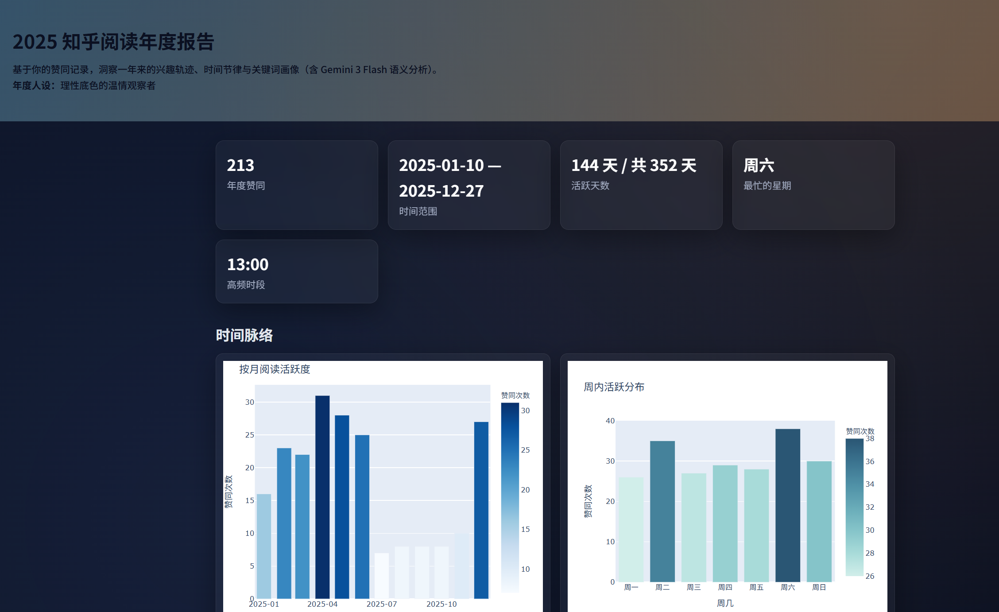

# Zhihu-Annual-Report-2025 📘

**你的知乎年度阅读报告生成器**

这是一个全自动化的 Python 工具，能够抓取你的知乎赞同动态，利用 AI (Gemini 3 Flash) 进行深度语义分析，最终生成一份包含交互式图表、词云和 AI 评语的精美 HTML 年度报告。

---

## ✨ 功能介绍

*   **自动抓取**: 使用 Playwright 模拟真实浏览器行为，自动登录并抓取知乎个人动态。
*   **数据清洗**: 自动过滤非 2025 年数据，仅保留“赞同回答”的高价值行为。
*   **AI 深度分析**: 接入 OpenRouter (Gemini 3 Flash)，对每一条阅读记录进行语义分类、关键词提取和情感分析。
*   **可视化报告**: 生成包含月度活跃图、周作息热力图、兴趣雷达、词云以及 AI 年度总结的 HTML 报告。

## 🛠️ 原理简述

本项目的工作流分为四个主要步骤：

1.  **爬虫 (Crawler)**: `crawler.py` 使用 Playwright 启动浏览器，保存 Cookies 后通过拦截网络请求（Network Interception）获取动态 API 数据，解决无限滚动加载问题。
2.  **清洗 (Processor)**: `data_processor.py` 使用 Pandas 将原始 JSON 数据转换为结构化的 CSV，并过滤掉无效或过往年份的数据。
3.  **AI 标注 (Analysis)**: `api_analyse.py` 将清洗后的数据分块发送给 LLM，让 AI 为每条记录打上“科技”、“职场”、“情感”等标签，并提取核心关键词。
4.  **渲染 (Render)**: `annual_report.py` 结合 Plotly 和 WordCloud，将统计数据渲染为静态 HTML 页面，前端代码由 AI 辅助生成。

## 🚀 快速开始

### 1. 环境准备

确保你的 Python 版本 >= 3.10。

安装依赖库：
```bash
pip install pandas playwright requests plotly wordcloud jieba
```

安装浏览器内核：
```bash
playwright install chromium
```

### 2. 运行步骤

1. **登录知乎**
运行后会弹出浏览器，请在手机端扫码登录，登录成功后会自动保存 cookies.json

```bash 
python crawler.py login
```

2. **爬取数据**
自动滚动抓取动态，直到遇到 2025 年之前的数据停止。

```bash 
python crawler.py 
```

3. **数据清洗**
将原始 JSON 转换为 CSV。

```bash 
python data_processor.py
```


4. **AI分析**
调用 LLM 对数据进行分类和关键词提取（需要消耗少量 Token）。

```bash 
python api_analyse.py
```

5. **生成报告**
在当前目录下生成 annual_report.html，直接用浏览器打开即可查看。

```bash 
python annual_report.py
```

## 💡 心路历程 (Dev Journey)
这个项目的诞生经历了一次有趣的“AI 驱动开发”转型。

起初，我制定了一份 claude.md 路线图，原本计划完全依赖 Claude 的 Web 界面来指导我写代码，按部就班地从爬虫写到分析。

后来，在实际编码过程中，我切换到了更习惯的 GitHub Copilot (配合 VS Code)。

最终生成的 annual_report.html 前端代码，几乎完全是由 GPT-5.2 和 Gemini 3 Pro 生成的。但是整体方向依然需要我来把控，比如是我提出要尽量多利用llm来分析提取关键词，当然现在也保留了结巴分词的关键词。

更重要的是，我意识到了数据的重要性，最终呈现出来比较好的分析效果也是由于我点赞了大量优质的知乎回答内容，这样分析才有着力点。要特别感谢优质内容的贡献者。

更更重要的是，我还意识到了自己刷了太多时间的知乎，明年应该控制一下。


## 最终效果图

